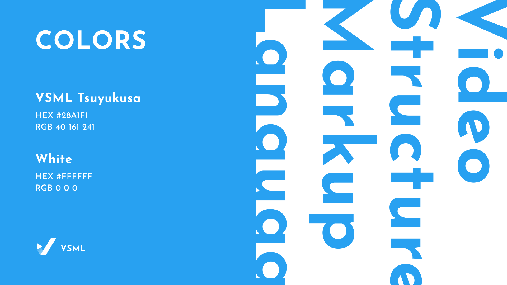
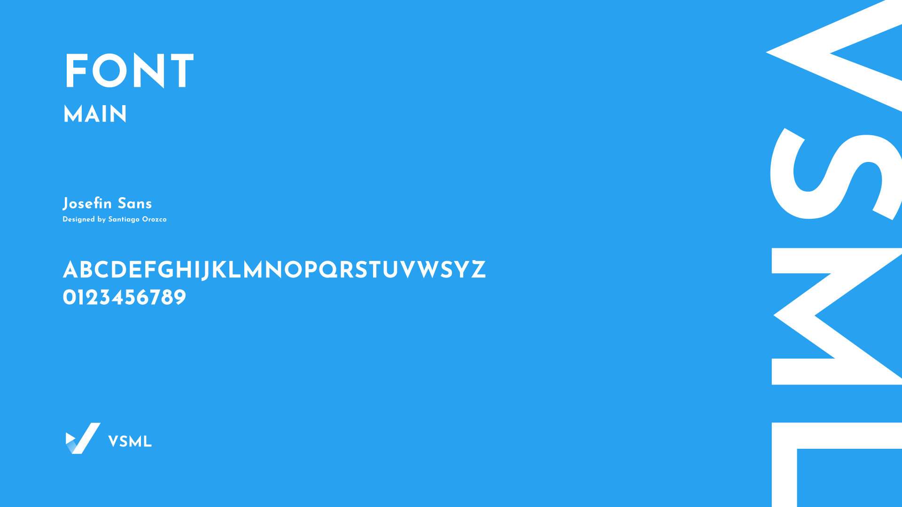

# VSML Artworks

This repository contains the artworks created for the [VSML](https://github.com/vsml-org) community. 
The artworks are official and the community is encouraged to use them.

## Guidelines
### Logo
The logo is the primary identity of the community. It should be used in all official documents, websites, and social media platforms.

.png, .svg are available in the `logos` directory.

#### Mark only logo

.png, .svg are available in the `logos` directory.

### Color Palette
The color palette is the primary color scheme of the community. It should be used in all official documents, websites, and social media platforms. 

VSML Tsuyukusa: `#28A1F1`

White: `#FFFFFF`

### Font
The font used in the logo is `Josefin Sans` designed by Santiago Orozco. It is a free font available on [Google Fonts](https://fonts.google.com/specimen/Josefin+Sans).

Logo and title should be in `Bold` style.
Capital letters are appropriate for the logo.

## License
 

<a property="dct:title" rel="cc:attributionURL" href="https://github.com/vsml-org/artwork">VSML Artworks</a> by <a rel="cc:attributionURL dct:creator" property="cc:attributionName" href="https://github.com/vsml-org">VSML Community</a>, <a rel="cc:attributionURL dct:creator" property="cc:attributionName" href="https://github.com/CinnamonSea2073">CinnamonSea2073</a> is licensed under <a href="https://creativecommons.org/licenses/by-nc-sa/4.0/?ref=chooser-v1" target="_blank" rel="license noopener noreferrer" style="display:inline-block;">CC BY-NC-SA 4.0</a>
